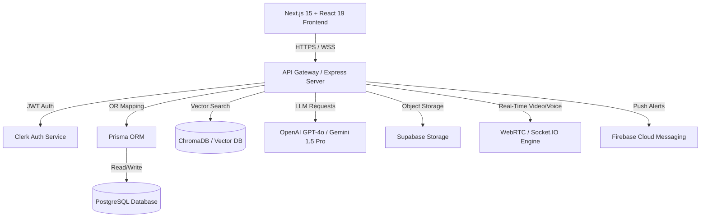

# 🚀 Project KAIRO — Software Requirements Specification (SRS)

**Document Version:** 1.0.0  
**Target Release:** Production v1.0 → v10.0  
**Founder:** Kritika Jha  
**Tagline:** *From Potential to Progress.*  
**Status:** Approved Architectural Blueprint  

---

## 📋 Executive Summary & Startup Vision

### 1.1 Vision & Mission
KAIRO is an AI-powered student growth companion engineered to transform learners from **Confusion → Clarity**, **Fear → Confidence**, and **Potential → Progress**. 

Instead of acting merely as a static content provider or generic chat interface, KAIRO is an active, habit-forming daily companion that balances personalized skill roadmaps, daily schedule planning, AI concept tutoring, voice communication coaching, peer accountability, placement preparation, and automated AI check-ins.

### 1.2 Target User Persona
- **Primary Persona:** Engineering, Computer Science, Data Science, and Tech Undergraduate Students (Years 1–4).
- **Secondary Persona:** Self-taught developers, bootcamp career changers, and placement candidates preparing for technical interviews (Software, AI/ML, Cybersecurity).

### 1.3 System Constraints & Performance SLAs
- **Page Load Speed:** < 1.5 seconds worldwide (Vercel Edge Network CDN).
- **AI Latency (First Token TTFT):** < 400ms via streaming server-sent events (SSE) or WebSockets.
- **P99 API Latency:** < 200ms for database read/write queries.
- **Availability Target:** 99.99% operational uptime.
- **Security Standards:** OAuth 2.0 / Clerk JWT authentication, AES-256 encrypted database backups, CORS origin locking, and OWASP Top 10 compliance.

---

## 🏗️ System Architecture & Data Flow



### 2.1 Technology Stack Architecture
- **Frontend Layer:** Next.js 15 (App Router, React Server Components), React 19, TypeScript, Tailwind CSS, Shadcn UI, Framer Motion.
- **Backend API Gateway:** Node.js, Express.js microservices, Prisma ORM.
- **Database Layer:** PostgreSQL (Transactional), ChromaDB / Pinecone (Vector Embeddings for RAG).
- **Authentication:** Clerk Auth (Google, GitHub, Email Magic Links, JWT).
- **AI Engine:** OpenAI API (GPT-4o), Google Gemini 1.5 Pro, LangChain orchestration framework.
- **Realtime & Media Engine:** Socket.IO, WebRTC (Peer-to-peer video study rooms & voice stream).
- **Storage & Assets:** Supabase Storage (PDF notes, resume uploads, user avatars).

---

## 🗄️ Database Schema Specification (18 Tables)

```prisma
// Prisma Schema Definition - Project KAIRO

datasource db {
  provider = "postgresql"
  url      = env("DATABASE_URL")
}

generator client {
  provider = "prisma-client-js"
}

enum Role {
  STUDENT
  MENTOR
  ADMIN
}

enum Category {
  STUDY
  COLLEGE
  HEALTH
  INTERVIEW
  REST
}

// 1. Users Table
model User {
  id              String         @id @default(uuid())
  clerkId         String         @unique
  name            String
  email           String         @unique
  avatarUrl       String?
  college         String?
  branch          String?
  graduationYear  String?
  skillLevel      String         @default("Intermediate")
  hoursPerDay     Int            @default(4)
  role            Role           @default(STUDENT)
  createdAt       DateTime       @default(now())
  updatedAt       DateTime       @updatedAt

  goals           Goal[]
  roadmaps        Roadmap[]
  tasks           Task[]
  notes           Note[]
  chats           Chat[]
  achievements    Achievement[]
  rewards         UserReward[]
  friendsSent     Friendship[]   @relation("Sender")
  friendsRecv     Friendship[]   @relation("Receiver")
  studySessions   StudySession[]
  progress        ProgressStat?
}

// 2. Goals Table
model Goal {
  id          String   @id @default(uuid())
  userId      String
  user        User     @relation(fields: [userId], references: [id], onDelete: Cascade)
  title       String
  targetDate  DateTime?
  completed   Boolean  @default(false)
  createdAt   DateTime @default(now())
}

// 3. Roadmaps Table
model Roadmap {
  id          String        @id @default(uuid())
  userId      String
  user        User          @relation(fields: [userId], references: [id], onDelete: Cascade)
  goalTrack   String
  totalWeeks  Int           @default(4)
  nodes       RoadmapNode[]
  createdAt   DateTime      @default(now())
}

// 4. RoadmapNodes Table
model RoadmapNode {
  id          String   @id @default(uuid())
  roadmapId   String
  roadmap     Roadmap  @relation(fields: [roadmapId], references: [id], onDelete: Cascade)
  weekNum     Int
  dayNum      Int
  title       String
  description String?
  category    String
  completed   Boolean  @default(false)
}

// 5. Tasks Table
model Task {
  id          String   @id @default(uuid())
  userId      String
  user        User     @relation(fields: [userId], references: [id], onDelete: Cascade)
  timeSlot    String
  title       String
  category    Category @default(STUDY)
  orderIndex  Int      @default(0)
  completed   Boolean  @default(false)
  createdAt   DateTime @default(now())
}

// 6. Notes Table
model Note {
  id          String      @id @default(uuid())
  userId      String
  user        User        @relation(fields: [userId], references: [id], onDelete: Cascade)
  title       String
  content     String
  folder      String      @default("General")
  aiSummary   String?
  flashcards  Flashcard[]
  createdAt   DateTime    @default(now())
  updatedAt   DateTime    @updatedAt
}

// 7. Flashcards Table
model Flashcard {
  id          String   @id @default(uuid())
  noteId      String
  note        Note     @relation(fields: [noteId], references: [id], onDelete: Cascade)
  front       String
  back        String
  mastered    Boolean  @default(false)
}

// 8. Chats Table
model Chat {
  id          String    @id @default(uuid())
  userId      String
  user        User      @relation(fields: [userId], references: [id], onDelete: Cascade)
  title       String
  messages    Message[]
  createdAt   DateTime  @default(now())
  updatedAt   DateTime  @updatedAt
}

// 9. Messages Table
model Message {
  id              String   @id @default(uuid())
  chatId          String
  chat            Chat     @relation(fields: [chatId], references: [id], onDelete: Cascade)
  sender          String   // 'user' or 'bot'
  content         String
  attachmentUrl   String?
  createdAt       DateTime @default(now())
}

// 10. ProgressStats Table
model ProgressStat {
  id               String   @id @default(uuid())
  userId           String   @unique
  user             User     @relation(fields: [userId], references: [id], onDelete: Cascade)
  streakDays       Int      @default(1)
  studyHours       Float    @default(0.0)
  problemsSolved   Int      @default(0)
  skillsCompleted  Int      @default(0)
  productivityScore Int     @default(85)
  aiUsageTokens    Int      @default(0)
  updatedAt        DateTime @updatedAt
}

// 11. Achievements Table
model Achievement {
  id          String   @id @default(uuid())
  userId      String
  user        User     @relation(fields: [userId], references: [id], onDelete: Cascade)
  badgeName   String
  description String
  unlockedAt  DateTime @default(now())
}

// 12. Rewards Table
model UserReward {
  id          String   @id @default(uuid())
  userId      String
  user        User     @relation(fields: [userId], references: [id], onDelete: Cascade)
  rewardName  String
  coinsCost   Int
  redeemed    Boolean  @default(false)
  redeemedAt  DateTime @default(now())
}

// 13. Friendship Table
model Friendship {
  id          String   @id @default(uuid())
  senderId    String
  sender      User     @relation("Sender", fields: [senderId], references: [id])
  receiverId  String
  receiver    User     @relation("Receiver", fields: [receiverId], references: [id])
  status      String   // 'PENDING', 'ACCEPTED'
  createdAt   DateTime @default(now())
}

// 14. StudySessions Table
model StudySession {
  id          String   @id @default(uuid())
  userId      String
  user        User     @relation(fields: [userId], references: [id], onDelete: Cascade)
  roomName    String
  durationMin Int
  createdAt   DateTime @default(now())
}

// 15. Companies Table
model Company {
  id            String               @id @default(uuid())
  name          String               @unique
  logoUrl       String?
  hiringPattern String
  questions     InterviewQuestion[]
}

// 16. InterviewQuestions Table
model InterviewQuestion {
  id          String   @id @default(uuid())
  companyId   String
  company     Company  @relation(fields: [companyId], references: [id], onDelete: Cascade)
  topic       String
  question    String
  solution    String
  difficulty  String   // 'EASY', 'MEDIUM', 'HARD'
}

// 17. Internships Table
model Internship {
  id          String   @id @default(uuid())
  title       String
  companyName String
  location    String
  stipend     String
  applyUrl    String
  createdAt   DateTime @default(now())
}

// 18. Hackathons Table
model Hackathon {
  id          String   @id @default(uuid())
  title       String
  organizer   String
  prizePool   String
  eventDate   DateTime
  applyUrl    String
}
```

---

## 🖥️ Screen & UI Flow Inventory

### 1. Screen 1: Onboarding & Goal Assessment
- **Purpose:** Collect college, year, current skills, dream company, and daily hours.
- **Workflow:** User logs in via Clerk → Step form collects preferences → AI Engine triggers initial customized Roadmap generation → User lands on Dashboard.

### 2. Screen 2: AI Mentor Studio
- **Purpose:** 24/7 personal tutor for concepts, code debugging, DSA, and interview prep.
- **Components:** Concept depth selector (*Beginner*, *Intermediate*, *Deep Dive*), Voice Microphone button (STT), Voice Speaker Output toggle (TTS), Attachment Upload button, Saved Chats sidebar drawer, Markdown code editor with syntax highlighting.

### 3. Screen 3: Personalized Skill Roadmap
- **Purpose:** Structured daily learning milestones based on career track.
- **Components:** Track selector, Goal completion progress bar, Week/Day milestone accordions, completion checkboxes with dynamic progress update handlers.

### 4. Screen 4: Smart Planner & Drag-and-Drop Timeline
- **Purpose:** AI daily schedule balancer.
- **Components:** Category-tagged task cards (*Study*, *College*, *Health*, *Interview*, *Rest*), HTML5 Drag-and-Drop handles, 25-minute Pomodoro focus timer with ring progress animation.

### 5. Screen 5: Growth Velocity Dashboard
- **Purpose:** Real-time progress analytics.
- **Components:** Streak Days counter, Focus Hours total, Problems Solved metric, Productivity Score card, Weekly velocity bar graph, AI Token Usage meter, unlocked achievement badges grid.

### 6. Screen 6: Smart Notes & 3D Flashcards
- **Purpose:** Rich text concept notes, summary extraction, and interactive study decks.
- **Components:** Folder tree, Note search bar, Note editor textarea, "AI Summarize" takeaway box, "Convert to Flashcards" modal (3D flip cards), "Export PDF" button.

### 7. Screen 7: Communication Coach (Phase 7)
- **Purpose:** Evaluate speech grammar, fluency, vocabulary, and confidence.
- **Components:** Speech recorder widget, realtime transcript analyzer, confidence percentage meter, grammar correction breakdown.

### 8. Screen 8: Placement & Interview Prep Hub (Phase 8)
- **Purpose:** Company-specific interview roadmaps and past questions.
- **Components:** Company cards (Google, Amazon, Microsoft, Meta), company interview questions, ATS resume checker.

### 9. Screen 9: Study Buddy & Video Study Rooms (Phase 9)
- **Purpose:** Match students with similar goals for peer study sessions.
- **Components:** Buddy match card recommendations, WebRTC group video study room, shared pomodoro timer.

### 10. Screen 10: AI Friend & Daily Companion (Phase 10)
- **Purpose:** Proactive morning check-ins and motivational accountability.
- **Components:** Proactive morning message pop-up, inactivity reminder, daily streak protector.

---

## 📡 API Endpoint Reference Matrix

| Endpoint | Method | Authentication | Description |
| :--- | :--- | :--- | :--- |
| `/api/v1/auth/me` | `GET` | Required (JWT) | Fetch current user profile & goal preferences |
| `/api/v1/mentor/chats` | `GET / POST` | Required | List user saved chats or create new chat session |
| `/api/v1/mentor/messages` | `POST` | Required | Send message to AI mentor with attachment & depth level |
| `/api/v1/roadmap` | `GET` | Required | Get current active roadmap & node completion status |
| `/api/v1/roadmap/generate` | `POST` | Required | Generate custom AI roadmap based on user goals |
| `/api/v1/roadmap/node/toggle` | `POST` | Required | Toggle node completion & update dashboard stats |
| `/api/v1/planner` | `GET` | Required | Fetch daily schedule tasks |
| `/api/v1/planner/reorder` | `POST` | Required | Reorder tasks via Drag & Drop order indices |
| `/api/v1/planner/generate` | `POST` | Required | AI auto-balance daily schedule based on habits |
| `/api/v1/dashboard/stats` | `GET` | Required | Fetch streak, focus hours, velocity, and AI tokens |
| `/api/v1/notes` | `GET / POST` | Required | Manage notes list and update title/content |
| `/api/v1/notes/:id/flashcards` | `POST` | Required | Generate 3D flashcard study deck from note content |
| `/api/v1/communication/evaluate`| `POST` | Required | Process voice audio recording and evaluate fluency |
| `/api/v1/studybuddy/match` | `GET` | Required | Get matched peer students based on target goal |

---

## 🤖 AI Workflows & Prompt Engineering Pipelines

```text
User Input Message + Attachment Context
                ↓
    [Context Assembly Engine]
  - Pull User Goal & Skill Level
  - Retrieve top-k relevant vector docs from ChromaDB
                ↓
    [System Prompt Injection]
  - Role: Senior Technical Mentor & Coach
  - Style: Concise, Encouraging, Action-Oriented
  - Depth: Beginner (ELIF5) / Intermediate (Code) / Deep Dive (Math)
                ↓
    [LLM Execution - GPT-4o / Gemini]
                ↓
    [Output Post-Processor]
  - Parse Code Blocks (js, python, html)
  - Generate Speech Synthesis Stream (TTS) if enabled
```

---

## 🔄 User Journeys & Daily Active Loop

```text
7:00 AM ──> Morning Alert: "Good Morning Kritika! 🌞 Ready for 40 mins of DSA?" (AI Friend)
8:30 AM ──> College Lectures / Classes
2:30 PM ──> Smart Planner Pomodoro Session: Solve 2 LeetCode Mediums
4:30 PM ──> Ask AI Mentor: "Explain Recursion vs Iteration in depth" (Voice Input)
6:00 PM ──> Fitness / Health Task Completed in Planner
8:00 PM ──> Review Smart Notes & Study 3D Flashcards Deck
10:00 PM ──> Streak Incremented (13 Days 🔥) + Level Up XP Collected!
```

---

> **Built for Scale. Designed for Student Success. Project KAIRO v1.0 → v10.0** 🚀
